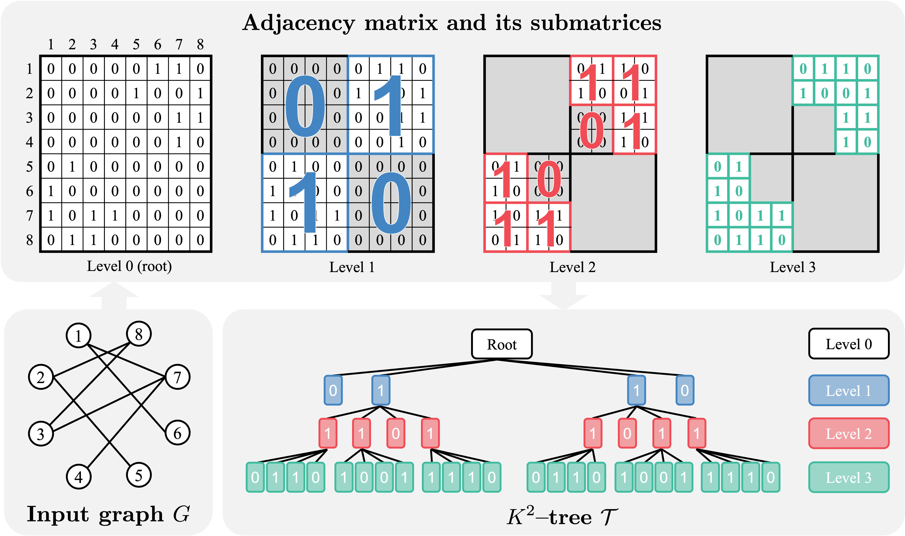

# Graph Generation with $K^2$-trees (ICLR 2024)

In this repository, we implement the paper: [Graph Generation with $K^{2}$-Tree (HGGT)](https://openreview.net/pdf?id=RIEW6M9YoV).

<p align="center">
    
</p>

## Contribution

+ We propose a new graph generative model based on adopting the $K^2$-tree as a compact, hierarchical, and domain-agnostic representation of graphs.
+ We introduce a novel, compact sequential $K^2$-tree representation obtained from pruning, flattening, and tokenizing the $K^2$-tree.
+ We propose an autoregressive model to generate the sequential $K^2$-tree representation using Transformer architecture with a specialized positional encoding scheme.
+ We validate the efficacy of our framework by demonstrating state-of-the-art graph generation performance on five out of six graph generation benchmarks.

## Dependencies

HGGT is built in Python 3.10.0, PyTorch 1.12.1, and PyTorch Geometric 2.2.0 . Use the following commands to install the required python packages.

```sh
pip install Cython
pip install -r requirements.txt
pip install rdkit==2020.9.5
pip install git+https://github.com/fabriziocosta/EDeN.git
pip install pytorch-lightning==1.9.3
pip install treelib
pip install networkx==2.8.7
```

## Running experiments

### 1. Data preparation

We provide four generic datasets (community-small, enzymes, grid, and planar) and two molecular datasets (ZINC250k, and QM9). You can download the pickle files of five datasets (community-small, enzymes, grid, ZINC250k, and QM9) from https://github.com/harryjo97/GDSS/tree/master and the other from https://github.com/KarolisMart/SPECTRE. 

After downloading the pickle file into the `reource/${dataset_name}/` directory, make a new directory `reource/${dataset_name}/${order}/` to store sequence representations. Then you can generate sequence representations of $K^2$-tree by running:

```sh
 python generate_string.py --dataset_name ${dataset_name} --order ${order} --k ${k}
```

For example,
```sh
 python generate_string.py --dataset_name GDSS_com --order C-M --k 2
```

### 2. Configurations

The configurations are given in `config/trans/` directory. Note that max_len denotes the maximum length of the sequence representation in generation. We set max_len as the maximum length of sequence representations of training and test graphs.

### 3. Training and evaluation

You can train HGGT model and generate samples by running:
```sh
CUDA_VISIBLE_DEVICES=${gpu_id} bash script/trans/{script_name}.sh
```

For example, 
```sh
CUDA_VISIBLE_DEVICES=0 bash script/trans/com_small_2.sh
```

Then the generated samples are saved in  `samples/` directory and the metrics are reported on WANDB.
